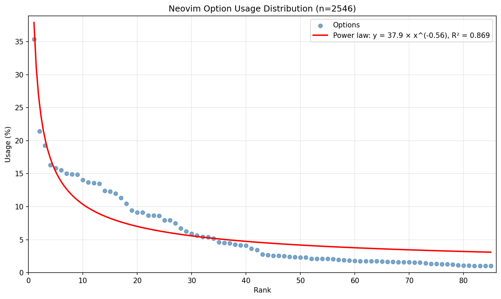

This script analyzes Neovim Lua configurations hosted on GitHub and returns the most commonly used settings.

# Result

Most common Neovim config out of 2546 init.lua files

0. ```vim.opt.mapleader = " "``` 35.39%
1. ```vim.opt.number = true``` 21.41%
2. ```vim.opt.maplocalleader = " "``` 19.29%
3. ```vim.opt.termguicolors = true``` 16.30%
4. ```vim.opt.shiftwidth = 4``` 15.83%
5. ```vim.opt.tabstop = 4``` 15.55%
6. ```vim.opt.ignorecase = true``` 15.04%
7. ```vim.opt.relativenumber = true``` 14.93%
8. ```vim.opt.expandtab = true``` 14.85%
9. ```vim.opt.smartcase = true``` 14.06%
10. ```vim.opt.mouse = "a"``` 13.67%
11. ```vim.opt.signcolumn = "yes"``` 13.59%
12. ```vim.opt.clipboard = "unnamedplus"``` 13.47%
13. ```vim.opt.undofile = true``` 12.41%
14. ```vim.opt.scrolloff = 10``` 12.29%
15. ```vim.opt.cursorline = true``` 11.98%
16. ```vim.opt.updatetime = 250``` 11.35%
17. ```vim.opt.hlsearch = true``` 10.45%
18. ```vim.opt.timeoutlen = 300``` 9.43%
19. ```vim.opt.splitright = true``` 9.15%
20. ```vim.opt.list = true``` 9.11%
21. ```vim.opt.listchars = { tab = '» ', trail = '·', nbsp = '␣' }``` 8.64%
22. ```vim.opt.splitbelow = true``` 8.64%
23. ```vim.opt.breakindent = true``` 8.60%
24. ```vim.opt.wrap = false``` 7.97%
25. ```vim.opt.softtabstop = 4``` 7.97%
26. ```vim.opt.showmode = false``` 7.50%
27. ```vim.opt.have_nerd_font = true``` 6.72%
28. ```vim.opt.inccommand = "split"``` 6.25%
29. ```vim.opt.completeopt = "menuone,noselect"``` 5.89%
30. ```vim.opt.swapfile = false``` 5.66%
31. ```vim.opt.loaded_netrwPlugin = 1``` 5.46%
32. ```vim.opt.smartindent = true``` 5.38%
33. ```vim.opt.loaded_netrw = 1``` 5.18%
34. ```vim.opt.incsearch = true``` 4.60%
35. ```vim.opt.background = "dark"``` 4.52%
36. ```vim.opt.colorcolumn = 80``` 4.44%
37. ```vim.opt.laststatus = 3``` 4.24%
38. ```vim.opt.backup = false``` 4.16%
39. ```vim.opt.autoindent = true``` 4.12%
40. ```vim.opt.base46_cache = vim.fn.stdpath "data" .. "/nvchad/base46/"``` 3.65%
41. ```vim.opt.foldmethod = "expr"``` 3.46%
42. ```vim.opt.hidden = true``` 2.75%
43. ```vim.opt.encoding = "utf-8"``` 2.67%
44. ```vim.opt.foldenable = true``` 2.55%
45. ```vim.opt.confirm = true``` 2.55%
46. ```vim.opt.undodir = "os.getenv("HOME") .. "/.vim/undodir""``` 2.51%
47. ```vim.opt.showmatch = true``` 2.40%
48. ```vim.opt.python3_host_prog = "/usr/bin/python3"``` 2.36%
49. ```vim.opt.smarttab = true``` 2.32%
50. ```vim.opt.cmdheight = 1``` 2.32%
51. ```vim.opt.foldlevel = 99``` 2.12%
52. ```vim.opt.autoread = true``` 2.12%
53. ```vim.opt.netrw_banner = 0``` 2.12%
54. ```vim.opt.guifont = "JetBrains Mono" .. ":h" .. font_siz"``` 2.08%
55. ```vim.opt.statusline = "%!v:lua.require('nvchad.statusline." .. config.ui.statusline.theme .. "').run()"``` 2.04%
56. ```vim.opt.timeout = true``` 1.96%
57. ```vim.opt.foldexpr = "nvim_treesitter#foldexpr()"``` 1.89%
58. ```vim.opt.textwidth = 80``` 1.85%
59. ```vim.opt.linebreak = true``` 1.81%
60. ```vim.opt.backspace = "indent,eol,start"``` 1.77%
61. ```vim.opt.netrw_winsize = 25``` 1.73%
62. ```vim.opt.guicursor = ""``` 1.73%
63. ```vim.opt.ruler = true``` 1.73%
64. ```vim.opt.sidescrolloff = 8``` 1.69%
65. ```vim.opt.showcmd = true``` 1.65%
66. ```vim.opt.spell = true``` 1.65%
67. ```vim.opt.conceallevel = 2``` 1.61%
68. ```vim.opt.writebackup = false``` 1.61%
69. ```vim.opt.netrw_browse_split = 0``` 1.57%
70. ```vim.opt.winborder = "rounded"``` 1.53%
71. ```vim.opt.wildmenu = true``` 1.53%
72. ```vim.opt.wildmode = "longest:full,full"``` 1.45%
73. ```vim.opt.foldlevelstart = 99``` 1.34%
74. ```vim.opt.showtabline = 2``` 1.34%
75. ```vim.opt.title = true``` 1.30%
76. ```vim.opt.spelllang = "en_us"``` 1.30%
77. ```vim.opt.fillchars = { eob = " " }``` 1.22%
78. ```vim.opt.filetype = "xml"``` 1.14%
79. ```vim.opt.nu = true``` 1.10%
80. ```vim.opt.foldcolumn = 1``` 1.06%
81. ```vim.opt.neovide_cursor_animation_length = 0``` 1.02%
82. ```vim.opt.shiftround = true``` 1.02%
83. ```vim.opt.loaded_perl_provider = 0``` 1.02%
84. ```vim.opt.shell = "/bin/zsh"``` 1.02%

# Colorscheme stat
0. catppuccin 5.89%
1. onedark 4.36%
2. tokyonight-night 3.57%
3. tokyonight 3.38%
4. gruvbox 2.91%
5. kanagawa 1.96%
6. rose-pine 1.34%
7. catppuccin-mocha 0.94%
8. vscode 0.86%
9. nightfox 0.63%

# Plugin stat
0. nvim-treesitter/nvim-treesitter 4.87%
1. nvim-lua/plenary.nvim 4.67%
2. neovim/nvim-lspconfig 4.44%
3. nvim-telescope/telescope.nvim 4.05%
4. NvChad/NvChad 3.57%
5. hrsh7th/nvim-cmp 3.53%
6. hrsh7th/cmp-nvim-lsp 3.46%
7. williamboman/mason.nvim 2.79%
8. L3MON4D3/LuaSnip 2.67%
9. nvim-tree/nvim-web-devicons 2.59%
10. nvim-lualine/lualine.nvim 2.51%
11. wbthomason/packer.nvim 2.44%
12. lewis6991/gitsigns.nvim 2.44%
13. saadparwaiz1/cmp_luasnip 2.20%
14. williamboman/mason-lspconfig.nvim 2.20%
15. hrsh7th/cmp-buffer 2.08%
16. hrsh7th/cmp-path 2.00%
17. tpope/vim-fugitive 1.81%
18. numToStr/Comment.nvim 1.73%
19. lukas-reineke/indent-blankline.nvim 1.69%
20. windwp/nvim-autopairs 1.57%
21. nvim-telescope/telescope-fzf-native.nvim 1.41%
22. nvim-tree/nvim-tree.lua 1.37%
23. folke/which-key.nvim 1.34%
24. catppuccin/nvim 1.26%
25. nvim-treesitter/nvim-treesitter-textobjects 1.18%
26. rafamadriz/friendly-snippets 1.14%
27. hrsh7th/cmp-cmdline 1.02%

# Plot
Strangely it doesn't follow the power law distribution. Likely because some settings are highly correlated with the others.


Power law fit: y = 37.9 × x^(-0.56), R² = 0.869

# Data

Last updated Dec 02 2025.
Repository list is queried from GitHub Code Search API.

Query: `filename:init.lua path:nvim`