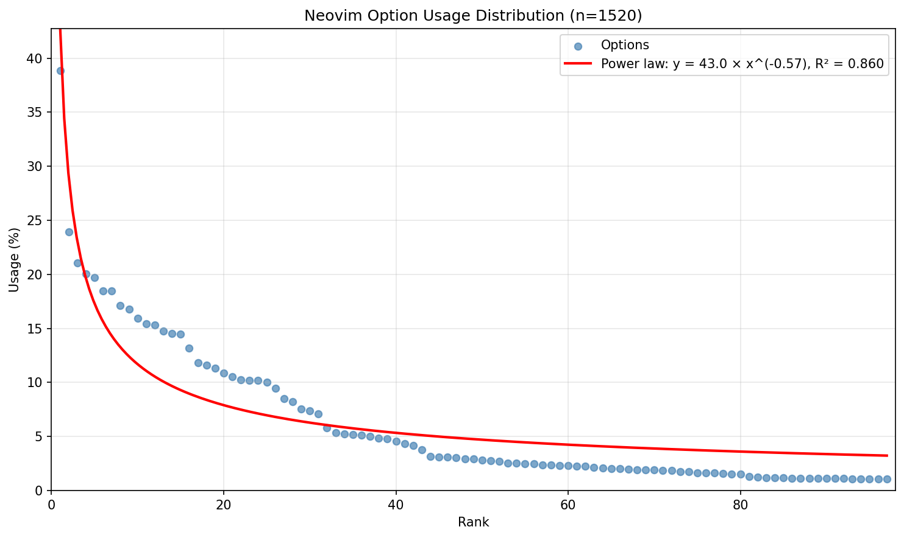

# eigen-neovim (formerly eigenvimrc)

TODO: create phylogenetic tree of vimrcs

This script analyzes Neovim Lua configurations hosted on GitHub and returns the most commonly used settings.
To see the old version analyzed on vimrc's, go to the [old/](./old) folder.

See [USAGE.md](./USAGE.md) if you want to reproduce the result.
The "voting" process may iterate as follows:

```python
def vote(default):
    init_lua = people_curate_their_init_lua()
    sleep(a_month)
    new_default = most_common_50_percent(init_lua)
    if new_default != default:
        return vote(new_default)
    else:
        return new_default
```

# Result

Most common Neovim config out of 1520 init.lua files

0. ```vim.opt.mapleader = " "``` 38.88%
1. ```vim.opt.number = true``` 23.95%
2. ```vim.opt.maplocalleader = " "``` 21.05%
3. ```vim.opt.shiftwidth = 4``` 20.07%
4. ```vim.opt.tabstop = 4``` 19.74%
5. ```vim.opt.expandtab = true``` 18.49%
6. ```vim.opt.relativenumber = true``` 18.49%
7. ```vim.opt.termguicolors = true``` 17.11%
8. ```vim.opt.ignorecase = true``` 16.78%
9. ```vim.opt.clipboard = "unnamedplus"``` 15.92%
10. ```vim.opt.smartcase = true``` 15.46%
11. ```vim.opt.scrolloff = 10``` 15.33%
12. ```vim.opt.cursorline = true``` 14.74%
13. ```vim.opt.signcolumn = "yes"``` 14.54%
14. ```vim.opt.mouse = "a"``` 14.47%
15. ```vim.opt.undofile = true``` 13.16%
16. ```vim.opt.updatetime = 250``` 11.84%
17. ```vim.opt.list = true``` 11.58%
18. ```vim.opt.splitright = true``` 11.32%
19. ```vim.opt.listchars = { tab = '» ', trail = '·', nbsp = '␣' }``` 10.86%
20. ```vim.opt.splitbelow = true``` 10.53%
21. ```vim.opt.timeoutlen = 300``` 10.26%
22. ```vim.opt.wrap = false``` 10.20%
23. ```vim.opt.hlsearch = true``` 10.20%
24. ```vim.opt.softtabstop = 4``` 10.00%
25. ```vim.opt.showmode = false``` 9.47%
26. ```vim.opt.have_nerd_font = true``` 8.49%
27. ```vim.opt.breakindent = true``` 8.22%
28. ```vim.opt.inccommand = "split"``` 7.57%
29. ```vim.opt.smartindent = true``` 7.37%
30. ```vim.opt.swapfile = false``` 7.11%
31. ```vim.opt.incsearch = true``` 5.79%
32. ```vim.opt.laststatus = 3``` 5.33%
33. ```vim.opt.colorcolumn = 80``` 5.26%
34. ```vim.opt.loaded_netrwPlugin = 1``` 5.20%
35. ```vim.opt.autoindent = true``` 5.13%
36. ```vim.opt.loaded_netrw = 1``` 5.00%
37. ```vim.opt.backup = false``` 4.87%
38. ```vim.opt.background = "dark"``` 4.80%
39. ```vim.opt.foldmethod = "expr"``` 4.54%
40. ```vim.opt.completeopt = "menuone,noselect"``` 4.34%
41. ```vim.opt.confirm = true``` 4.14%
42. ```vim.opt.base46_cache = vim.fn.stdpath "data" .. "/base46/"``` 3.75%
43. ```vim.opt.undodir = "os.getenv("HOME") .. "/.vim/undodir""``` 3.16%
44. ```vim.opt.cmdheight = 1``` 3.09%
45. ```vim.opt.foldenable = true``` 3.09%
46. ```vim.opt.foldlevel = 99``` 3.03%
47. ```vim.opt.hidden = true``` 2.96%
48. ```vim.opt.encoding = "utf-8"``` 2.96%
49. ```vim.opt.python3_host_prog = "/usr/bin/python3"``` 2.83%
50. ```vim.opt.showmatch = true``` 2.76%
51. ```vim.opt.autoread = true``` 2.70%
52. ```vim.opt.foldexpr = "nvim_treesitter#foldexpr()"``` 2.57%
53. ```vim.opt.winborder = "rounded"``` 2.57%
54. ```vim.opt.smarttab = true``` 2.50%
55. ```vim.opt.textwidth = 80``` 2.50%
56. ```vim.opt.netrw_banner = 0``` 2.37%
57. ```vim.opt.spell = true``` 2.37%
58. ```vim.opt.sidescrolloff = 8``` 2.30%
59. ```vim.opt.guicursor = ""``` 2.30%
60. ```vim.opt.guifont = "FiraCode Nerd Font:h12"``` 2.24%
61. ```vim.opt.linebreak = true``` 2.24%
62. ```vim.opt.conceallevel = 2``` 2.17%
63. ```vim.opt.wildmode = "longest:full,full"``` 2.11%
64. ```vim.opt.writebackup = false``` 2.04%
65. ```vim.opt.ruler = true``` 2.04%
66. ```vim.opt.fillchars = { eob = " " }``` 1.97%
67. ```vim.opt.backspace = "indent,eol,start"``` 1.91%
68. ```vim.opt.showcmd = true``` 1.91%
69. ```vim.opt.wildmenu = true``` 1.91%
70. ```vim.opt.netrw_winsize = 25``` 1.84%
71. ```vim.opt.timeout = true``` 1.84%
72. ```vim.opt.showtabline = 2``` 1.78%
73. ```vim.opt.statusline = " "``` 1.78%
74. ```vim.opt.netrw_browse_split = 0``` 1.64%
75. ```vim.opt.foldlevelstart = 99``` 1.64%
76. ```vim.opt.filetype = "xml"``` 1.64%
77. ```vim.opt.spelllang = "en_us"``` 1.58%
78. ```vim.opt.title = true``` 1.51%
79. ```vim.opt.wildignore = vim.opt.wildignore + '*.o,*.pyc,*.sw?'``` 1.51%
80. ```vim.opt.loaded_perl_provider = 0``` 1.32%
81. ```vim.opt.foldcolumn = 1``` 1.25%
82. ```vim.opt.nu = true``` 1.18%
83. ```vim.opt.loaded_ruby_provider = 0``` 1.18%
84. ```vim.opt.shell = "/bin/zsh"``` 1.18%
85. ```vim.opt.syntax = "on"``` 1.12%
86. ```vim.opt.cindent = true``` 1.12%
87. ```vim.opt.grepprg = "rg --vimgrep"``` 1.12%
88. ```vim.opt.neovide_cursor_animation_length = 0``` 1.12%
89. ```vim.opt.pumheight = 10``` 1.12%
90. ```vim.opt.shortmess = vim.opt.shortmess + "c"``` 1.12%
91. ```vim.opt.cursorcolumn = true``` 1.12%
92. ```vim.opt.lazyredraw = true``` 1.05%
93. ```vim.opt.showbreak = "↪"``` 1.05%
94. ```vim.opt.backupdir = "backup_dir"``` 1.05%
95. ```vim.opt.virtualedit = "block"``` 1.05%
96. ```vim.opt.pumblend = 10``` 1.05%

# Colorscheme stat
0. catppuccin 6.91%
1. tokyonight 4.93%
2. tokyonight-night 3.95%
3. onedark 3.68%
4. gruvbox 2.83%
5. kanagawa 2.17%
6. catppuccin-mocha 1.38%
7. rose-pine 1.38%
8. nightfox 0.79%
9. gruvbox-material 0.72%
10. vscode 0.66%
11. habamax 0.66%
12. rose-pine-moon 0.53%
13. ayu 0.53%
14. solarized 0.46%
15. dracula 0.46%
16. github 0.39%
17. nord 0.33%
18. kanagawa-wave 0.33%
19. tokyonight-storm 0.26%

# Plugin stat
0. nvim-treesitter/nvim-treesitter 4.08%
1. nvim-lua/plenary.nvim 3.88%
2. neovim/nvim-lspconfig 3.68%
3. NvChad/NvChad 3.62%
4. nvim-telescope/telescope.nvim 3.16%
5. hrsh7th/nvim-cmp 2.50%
6. nvim-tree/nvim-web-devicons 2.50%
7. hrsh7th/cmp-nvim-lsp 2.37%
8. nvim-lualine/lualine.nvim 2.24%
9. williamboman/mason.nvim 2.11%
10. L3MON4D3/LuaSnip 1.84%
11. williamboman/mason-lspconfig.nvim 1.84%
12. lewis6991/gitsigns.nvim 1.71%
13. hrsh7th/cmp-buffer 1.64%
14. tpope/vim-fugitive 1.45%
15. catppuccin/nvim 1.45%
16. hrsh7th/cmp-path 1.45%
17. folke/which-key.nvim 1.25%
18. windwp/nvim-autopairs 1.25%
19. saadparwaiz1/cmp_luasnip 1.25%
20. wbthomason/packer.nvim 1.05%

# Plot
Strangely it doesn't follow the power law distribution. Likely because some settings are highly correlated with the others.


Power law fit: y = 43.0 × x^(-0.57), R² = 0.860

# Data

Last updated Dec 03 2025.
Repository list is queried from GitHub Code Search API.

Query: `filename:init.lua path:nvim`